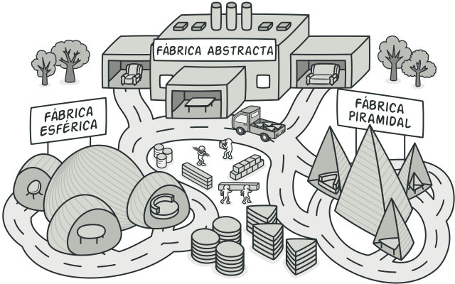

# Abstract Factory

## Propósito
Es un patron que nos permite producir familias de objetos relacionados sin especificar sus clases concretas.

  

## Problema

Imagina que estás creando un simulador de tienda de muebles. Tu código está compuesto por clses que representan lo siguiente. 
  1.  Una familia de productos relacionados, ejemplo: Silla + Sofá + Mesa.
  2.  Algunas variantes de esta familia. Por ejemplo, los 