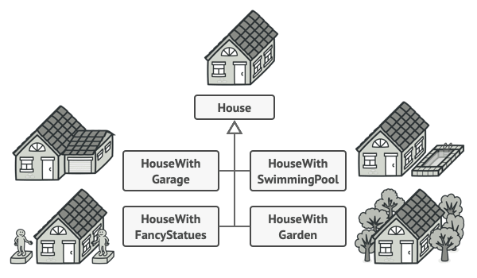
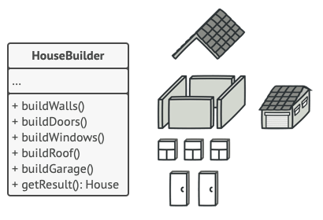

# Builder
También llamado constructor.

##  Objetivo
Es un patrón que nos permite crear objetos complejos *paso a paso*.
Es útil cuando necesitamos construir un objeto complejo con muchas partes y queremos que el proceso sea independiente de las partes que lo componen.

### Ejemplo

Necesitamos crear una casa, una sencilla solo requiere de unas puertas, ventanas y piso. ¿Pero que pasa con una casa mas compleja con pileta, o garage?
Para esto podemos extender la clase casa y crear un subconjunto de subclases que cubran las combinaciones de parámetros. Esto si bien cumple con el objetivo. Hace que el conjunto de subclases sea cada vez mas grandes y agregar un parámetro más requiere que se agregue una subclase más. 

### Solución

El patron builder sugiere que saques el código de construcción del objeto de su propia clase y lo coloques dentro de objetos independientes llamados constructores.

