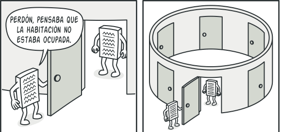

# Singleton
LLamado Única instancia.

## Propósito
Nos permite que una clase tenga una única instancia, haciendo que nadie pueda modificar lso atrubutos desde distintos lugares. También, proporciona un punto de acceso global a dicha instancia.

## 😕 Problema
Este patron resuelve dos problemas al mismo tiempo, vulnerando el *Principio de responsabilidad única*
  
  - Garantiza que una clase tenga una única instancia: Imagina que estas creando un objeto al cabo de un tiempo decides crear otro nuevo. Y en lugar de recibir un objeto nuevo recibes el anterior.
  

    
  <!--  -->
  - Brindar un único punto de acceso global:
Al igual que una variable global, el patrón Singleton nos permite acceder a un objeto desde cualquier parte del programa. No obstante, también evita que otro código sobreescriba esa instancia.

## 😎 Solución

- Hacer privado el constructor para que nadie pueda instanciarlo desde afuera.
- Crear un método de creación estático que actúe como constructor. Este constructor invoca al constructor privado. Las siguientes llamadas a este método devuelven el objeto almacenado en caché.

## 🔍 Aplicabilidad
 *Utiliza el patrón Singleton cuando una clase de tu programa tan solo deba tener una instancia disponible para todos los clientes; por ejemplo, un único objeto de base de datos compartido por distintas partes del programa.*

 El patrón Singleton deshabilita el resto de las maneras de crear objetos de una clase, excepto el método especial de creación. Este método crea un nuevo objeto, o bien devuelve uno existente si ya ha sido creado.

 *Utiliza el patrón Singleton cuando necesites un control más estricto de las variables globales.*

 Al contrario que las variables globales, el patrón Singleton garantiza que haya una única instancia de una clase. A excepción de la propia clase Singleton, nada puede sustituir la instancia en caché.

## 🎳 Ejemplos
- [DragonBall Singleton](./examples/01-singleton.ts)
- [Data Base Singleton](./examples/02-singleton.ts)
- [Alternative Singleton](./examples/03-singleton.ts)
